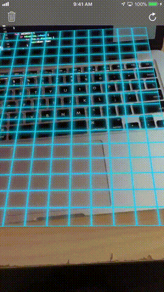

# ARDicee
Playing with ARKit to create a 3D dice roll app.

- Users detect a horizontal plane and a grid is displayed.
- A 3D die is placed on the grid according to the user's touch location.
- Users can detele or roll all dice at the same time.

### Skills
* ARKit
* SceneKit
* Horizontal Plane Detection
* Real World 3D Objects Touch Detection

## Finished App

Copyright © Hector Mendoza
